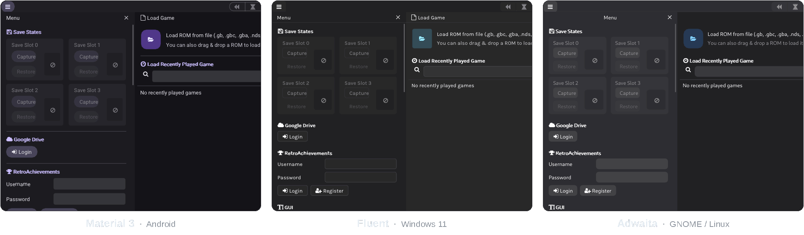
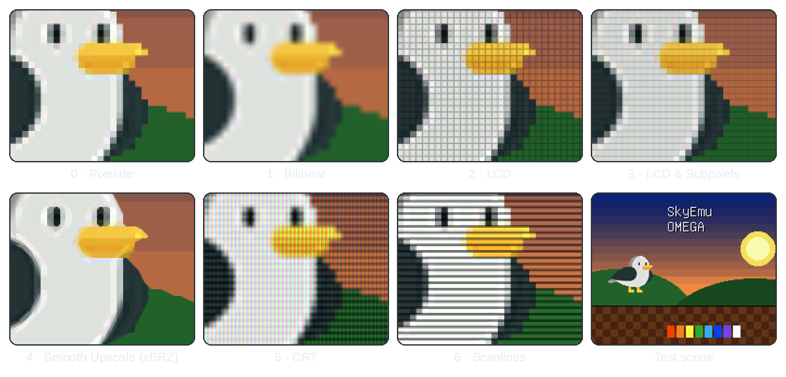

<div align="center">


# SkyEmu OMEGA

**A low-level Game Boy, Game Boy Color, Game Boy Advance and Nintendo DS emulator<br>that looks native on every platform and embeds into your own apps.**

[](LICENSE)
[](https://github.com/skylersaleh/SkyEmu)
[](#-platforms)

[](https://github.com/Pierreg99/SkyEmu-OMEGA-FORK/actions/workflows/deploy_linux.yml)
[](https://github.com/Pierreg99/SkyEmu-OMEGA-FORK/actions/workflows/deploy_win.yml)
[](https://github.com/Pierreg99/SkyEmu-OMEGA-FORK/actions/workflows/deploy_mac.yml)
[](https://github.com/Pierreg99/SkyEmu-OMEGA-FORK/actions/workflows/deploy_android.yml)
[](https://github.com/Pierreg99/SkyEmu-OMEGA-FORK/actions/workflows/deploy_ios.yml)
[](https://github.com/Pierreg99/SkyEmu-OMEGA-FORK/actions/workflows/deploy_web.yml)

[**Get started**](#-get-started) · [**Build**](docs/BUILDING.md) · [**Embed**](docs/EMBEDDING.md) · [**Design systems**](docs/DESIGN_SYSTEMS.md) · [**Shaders**](docs/GRAPHICS.md) · [**Controllers**](docs/CONTROLLERS.md) · [**Cheats & patches**](docs/CHEATS_AND_PATCHES.md) · [**Recording**](docs/RECORDING_AND_STREAMING.md) · [**All docs**](docs/README.md)

</div>

<br>

<picture>
  <source media="(prefers-color-scheme: dark)" srcset="docs/images/hero-dark.png">
  <source media="(prefers-color-scheme: light)" srcset="docs/images/hero-light.png">
  
</picture>

<p align="center"><sub>The same emulator in Material 3, Fluent and Adwaita. Light or dark mode and the accent color come from your system.</sub></p>

> [!NOTE]
> SkyEmu OMEGA is a fork of [SkyEmu](https://github.com/skylersaleh/SkyEmu) by Skyler "Sky" Saleh. The emulation
> cores are SkyEmu's. This fork adds platform native design systems with high contrast support, CRT and scanline
> shaders, and turns SkyEmu into a component that other apps can host on Windows, Android and iOS.

## Contents

- [Highlights](#-highlights)
- [What OMEGA adds](#-what-omega-adds)
- [Screen shaders](#-screen-shaders)
- [Platforms](#-platforms)
- [Get started](#-get-started)
- [Controls](#-controls)
- [Accuracy](#-accuracy)
- [Documentation](#-documentation)
- [Credits and license](#-credits-and-license)

## ✨ Highlights

<table>
<tr>
<td width="33%" valign="top">

### 🎮 Accurate cores
- Game Boy Advance with a per-pixel PPU, full pipeline and prefetch emulation
- Game Boy and Game Boy Color
- Nintendo DS (beta)
- Real time clock and solar sensor
- Works without BIOS files thanks to open source replacements

</td>
<td width="33%" valign="top">

### 🎨 Native look
- Material 3 / Material You on Android
- Fluent on Windows 11
- Adwaita on GNOME / Linux
- Light, dark and AMOLED black, following the system
- Standard or high contrast, following the system
- System accent colors and UI fonts
- The original SkyEmu skin and custom skins stay available

</td>
<td width="33%" valign="top">

### 🧩 Built to be embedded
- Windows DLL with a C API
- Android library with a JNI API
- iOS and macOS static libraries
- Framebuffer access and input injection
- REST-like HTTP control server for scripts and bots

</td>
</tr>
<tr>
<td valign="top">

### ⏪ Play your way
- Fast forward, slow motion and very long rewind
- 4 save state slots with screenshot previews
- Action Replay and GameShark codes, and a cheat finder that makes new ones
- IPS, UPS and BPS patches for ROM hacks and translations, applied without touching the ROM
- On-screen controller with a drag and drop layout editor
- Game controllers with rumble, readable button names and rebindable keys
- Video, sound and screenshot recording, and a replay buffer to save the last moments
- Remote Play in any browser and an overlay for OBS

</td>
<td valign="top">

### 🖥️ Great picture
- LCD, subpixel, xBRZ, CRT and scanline shaders
- GBA color correction (SkyEmu or Higan)
- Screen ghosting
- Flexible DS screen layouts

</td>
<td valign="top">

### 🧰 For tinkerers
- CPU, MMIO and memory debuggers
- RetroAchievements with Hardcore, Encore, unofficial and spectator modes
- Google Drive save state sync
- ROMs inside `.zip` archives
- Translated into 13 languages

</td>
</tr>
</table>

## 🌟 What OMEGA adds

| | Upstream SkyEmu | SkyEmu OMEGA |
|---|---|---|
| **GUI** | One image based skin (dark, light, black, custom) | Material 3, Fluent and Adwaita, chosen per platform, plus the original skin |
| **System integration** | | Dark mode, high contrast, accent color, UI font and window frame follow the OS |
| **Accessibility** | | A high contrast style for each design, checked by unit tests for 7:1 text and 3:1 borders |
| **Screen shaders** | Pixelate, bilinear, LCD, LCD & subpixels, xBRZ | Adds CRT and scanlines |
| **On-screen controller** | One fixed layout | Layout editor with separate portrait and landscape layouts, Rewind and Fast Forward buttons |
| **Game controllers** | Xbox style mapping | Choice of label or GBA positions for the face buttons, Xbox / PlayStation / Nintendo button names |
| **Cheats** | Action Replay engine, 32 codes | Cheat finder that searches memory and makes Action Replay / GameShark codes, 128 codes |
| **ROM patches** | | IPS, UPS and BPS soft patching, by drag and drop or next to the ROM |
| **RetroAchievements** | Hardcore and Encore Mode | Adds unofficial achievements, spectator mode and rich presence in the panel |
| **Recording** | | Videos (every frame, sound in sync, also when fast forwarded), sound, screenshots and a replay buffer |
| **Streaming** | | Live MJPEG and WAV streams, Remote Play in a browser with touch and controller input, an OBS overlay |
| **Windows** | Stand-alone app | `SkyEmu.dll` with a C API ([`skyemu_dll.h`](src/skyemu_dll.h)) for host apps |
| **Android** | Stand-alone app | Android library with a JNI settings and control API |
| **iOS / macOS** | Stand-alone app | Static libraries for host apps (the macOS app bundle is still available) |
| **Host APIs** | HTTP control server | Framebuffer access, key injection, UI and menu callbacks, save state slots, every setting, patches, cheats, the cheat finder and achievements as JSON |

The design systems are described in [docs/DESIGN_SYSTEMS.md](docs/DESIGN_SYSTEMS.md) and the host APIs in [docs/EMBEDDING.md](docs/EMBEDDING.md).

## 📺 Screen shaders

<picture>
  <source media="(prefers-color-scheme: dark)" srcset="docs/images/shaders-dark.png">
  <source media="(prefers-color-scheme: light)" srcset="docs/images/shaders-light.png">
  
</picture>

Seven shaders, from sharp pixels to a handheld LCD grid or a CRT with scanlines and an aperture grille. Pick one
in **Menu → Display Settings → Screen Shader**. Color correction, ghosting, integer scaling and the DS screen
layouts are in [docs/GRAPHICS.md](docs/GRAPHICS.md).

## 📦 Platforms

| Platform | Build output | Default design | Notes |
|---|---|---|---|
| **Windows** 10 / 11 | `SkyEmu.dll` | Fluent | Started by a host app through `win_main()` |
| **Linux** | `SkyEmu` executable | Adwaita | X11 or XWayland, ALSA audio |
| **FreeBSD** | `SkyEmu` executable | Adwaita | |
| **Android** 7.0+ | `libSkyEmu.so` in an Android library | Material 3 | Material You colors on Android 12+ |
| **macOS** | `SkyEmu.app`, or a static library | SkyEmu Classic | |
| **iOS** 15+ | Static library | SkyEmu Classic | The host app provides `main()` and calls `main_ios()` |
| **Web** | WebAssembly progressive web app | Material 3 | Follows the browser's color scheme |
| **libretro** | `skyemu_libretro` core | Frontend UI | For RetroArch and other frontends |

## 🚀 Get started

### Download

Every push builds all platforms on GitHub Actions. Open a workflow run under
[**Actions**](https://github.com/Pierreg99/SkyEmu-OMEGA-FORK/actions) and download its artifact
(`LinuxRelease`, `WindowsRelease`, `AndroidRelease`, ...).

Stand-alone releases of upstream SkyEmu, including a version that runs in the browser, are at
[github.com/skylersaleh/SkyEmu/releases](https://github.com/skylersaleh/SkyEmu/releases) and
[web.skyemu.app](https://web.skyemu.app/).

### Build from source

```sh
git clone https://github.com/Pierreg99/SkyEmu-OMEGA-FORK.git
cd SkyEmu-OMEGA-FORK
cmake -B build -DCMAKE_BUILD_TYPE=Release
cmake --build build --parallel
./build/bin/SkyEmu path/to/game.gba
```

Dependencies and the steps for Windows, Android, iOS, macOS, the web and libretro are in
[docs/BUILDING.md](docs/BUILDING.md).

### Games, saves and BIOS files

- Open a ROM (`.gb`, `.gbc`, `.gba`, `.nds` or a `.zip` of one) from the **Load Game** screen, by drag and drop,
  or as the first command line argument. Drop an `.ips`, `.ups` or `.bps` patch on the window to play a
  [ROM hack or translation](docs/CHEATS_AND_PATCHES.md#rom-patches) with it.
- Save files use the ROM name with a `.sav` extension (`Game.gba` → `Game.sav`) and live next to the ROM.
  In the web version, drop them onto the page or load them with the file picker.
- BIOS files are optional. SkyEmu ships open source replacements, but official dumps are more accurate and
  enable features such as the Game Boy Color colorization and boot animations. The GBA BIOS must be named
  `gba_bios.bin`.

> [!TIP]
> Change the look in **Menu → GUI → Design**: *Platform Native*, *Material 3*, *Fluent (Windows 11)*,
> *Adwaita (GNOME)* or *SkyEmu Classic*. Color scheme, contrast, accent color and font are right below it.

## 🎹 Controls

Every binding can be changed in **Menu → Keybinds**, and game controllers are mapped automatically. On touch
screens the on-screen controller appears when you touch the screen, and **Menu → Touch Control Settings →
Customize Layout** lets you move and resize its buttons. See [docs/CONTROLLERS.md](docs/CONTROLLERS.md).

| Console | Key | | Emulator | Key |
|---|---|---|---|---|
| D-Pad | <kbd>W</kbd> <kbd>A</kbd> <kbd>S</kbd> <kbd>D</kbd> | | Pause / play | <kbd>Space</kbd> |
| A / B | <kbd>J</kbd> / <kbd>K</kbd> | | Rewind | <kbd>R</kbd> |
| X / Y (DS) | <kbd>N</kbd> / <kbd>M</kbd> | | Fast forward 2× / max | <kbd>F</kbd> / <kbd>Tab</kbd> |
| L / R | <kbd>U</kbd> / <kbd>I</kbd> | | Save state 1–4 | <kbd>1</kbd> … <kbd>4</kbd> |
| Start / Select | <kbd>Enter</kbd> / <kbd>'</kbd> | | Load state 1–4 | <kbd>F1</kbd> … <kbd>F4</kbd> |
| Fold screen (DS) | <kbd>B</kbd> | | Solar sensor − / + | <kbd>-</kbd> / <kbd>=</kbd> |
| Tap screen (DS) | <kbd>V</kbd> | | Full screen | <kbd>F11</kbd> |
| | | | Record video / Save replay | <kbd>F9</kbd> / <kbd>F10</kbd> |
| | | | Screenshot | <kbd>F12</kbd> |

## 🎯 Accuracy

SkyEmu has been tested on hundreds of ROMs. Most games are playable with no or minor bugs, and the GBA core is
more accurate than the GB/GBC core.

<details>
<summary><b>Game Boy Advance</b></summary>

- Per-pixel PPU that handles scanline and mid-scanline effects
- Passes the AGS Aging test cartridge
- Runs hard to emulate games such as the Classic NES Series, Golden Sun and Hello Kitty Miracle Fashion Maker
- Passes all ArmWrestler, FuzzARM, `arm.gba` and `thumb.gba` tests
- Passes 2020/2020 GBA Suite timing tests with the official BIOS
- Full instruction pipeline and prefetch emulation

</details>

<details>
<summary><b>Game Boy / Game Boy Color</b></summary>

- Passes all of Blargg's CPU instruction tests
- Passes the DMG and CGB acid2 PPU tests and MBCtest
- Dot clock based PPU
- Anti-aliased audio synthesis with per-sample APU changes (Pikachu's voice in Pokémon Yellow works)

</details>

The comparison with other emulators is in [docs/Accuracy.md](docs/Accuracy.md).

## 📚 Documentation

| Page | What is inside |
|---|---|
| [Building](docs/BUILDING.md) | Dependencies and build steps for every platform |
| [Embedding](docs/EMBEDDING.md) | Hosting SkyEmu from a Windows, Android or iOS app |
| [Design systems](docs/DESIGN_SYSTEMS.md) | Material 3, Fluent, Adwaita, high contrast and how they follow the OS |
| [Display and shaders](docs/GRAPHICS.md) | Screen shaders, color correction, scaling and DS screen layouts |
| [Controllers](docs/CONTROLLERS.md) | On-screen controller, layout editor and game controller mapping |
| [Cheats and ROM patches](docs/CHEATS_AND_PATCHES.md) | Cheat codes, the cheat finder, and IPS / UPS / BPS patches |
| [RetroAchievements](docs/RETROACHIEVEMENTS.md) | Achievements, Hardcore, Encore, unofficial and spectator modes |
| [Recording and streaming](docs/RECORDING_AND_STREAMING.md) | Videos, screenshots, the replay buffer, Remote Play and OBS |
| [HTTP control server](docs/HTTP_CONTROL_SERVER.md) | Scripting and automation over HTTP |
| [Custom themes](docs/CUSTOM_THEMES.md) | Making image skins for the classic design |
| [Accuracy](docs/Accuracy.md) | Test ROM and game compatibility comparison |
| [Library modifications](docs/LibraryModifications.md) | Changes made to bundled third-party code |

## 🙏 Credits and license

SkyEmu is created by [Skyler "Sky" Saleh](https://github.com/skylersaleh) and
[its contributors](https://github.com/skylersaleh/SkyEmu/graphs/contributors). The Windows DLL, Android library
and iOS static library work comes from [toanlcgift](https://github.com/toanlcgift). The people and projects
that made the emulation possible are thanked in [ACKNOWLEDGMENTS.md](ACKNOWLEDGMENTS.md).

Questions about the emulator itself are welcome in the upstream
[SkyEmu Discord](https://discord.gg/tnUEtmJgA5).

<details>
<summary><b>Birds of a feather</b>: related projects</summary>

- [**Pokemon Bot**](https://github.com/OFFTKP/pokemon-bot): a Discord bot that connects to SkyEmu so your server can play GB/GBC/GBA/NDS games together
- [**Panda3DS**](https://github.com/wheremyfoodat/Panda3DS): a panda themed HLE 3DS emulator
- [**NanoBoyAdvance**](https://github.com/nba-emu/NanoBoyAdvance): a cycle-accurate GBA emulator focused on hardware research
- [**Dust**](https://github.com/kelpsyberry/dust): a DS emulator for desktop and the web
- [**Kaizen**](https://github.com/SimoneN64/Kaizen): an experimental low-level N64 emulator

</details>

SkyEmu OMEGA is released under the [MIT License](LICENSE). Game Boy, Game Boy Color, Game Boy Advance and
Nintendo DS are trademarks of Nintendo. This project is not affiliated with Nintendo.
