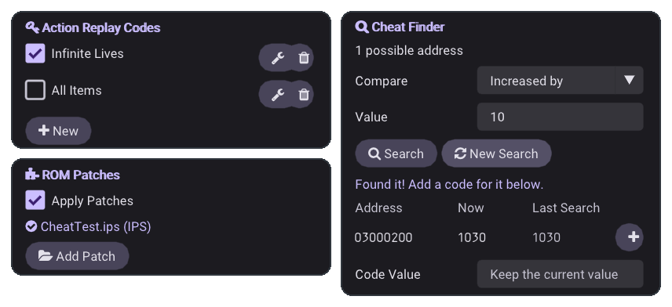

<sub>[SkyEmu OMEGA](../README.md) › [Docs](README.md) › Cheats and ROM patches</sub>

# Cheats and ROM patches

SkyEmu runs cheat codes, finds new ones for you and plays ROM hacks, translations and fixes straight from their
patch files. Everything is in the menu while a game is running.

<picture>
  <source media="(prefers-color-scheme: dark)" srcset="images/cheats-dark.png">
  <source media="(prefers-color-scheme: light)" srcset="images/cheats-light.png">
  
</picture>

> [!NOTE]
> Cheats and the cheat finder are turned off while you play in RetroAchievements
> [Hardcore Mode](RETROACHIEVEMENTS.md#modes). ROM patches still work.

## Cheat codes

Open **Menu → Action Replay Codes**, press **New**, give the code a name and type or paste it. Spaces and line
breaks don't matter. Tick the box next to a code to turn it on. Codes are applied every frame, so a code that
sets your lives keeps them at that number.

| Console | Code format |
|---|---|
| Game Boy, Game Boy Color | GameShark (`01VVLLHH`, RAM at A000–DFFF) |
| Game Boy Advance | Action Replay v3, encrypted, as printed in code lists |
| Nintendo DS | Action Replay DS, including conditions, loops and pointer codes |

A game can have 128 codes. They are saved in a `.code` file next to the save file, or in the **Cheat Code Path**
of **Menu → Additional Search Paths**.

## Cheat finder

When there is no code for what you want, the cheat finder finds where the game keeps the value, such as your
lives, money or health, and makes the code for you.

1. Open **Menu → Cheat Finder** and pick the **Value Size**: 8-bit for numbers up to 255 (lives, most items),
   16-bit for numbers up to 65,535 (money in many games), 32-bit for larger ones. Turn on **Signed Values** for
   numbers that can go below zero.
2. Press **Start Search**. SkyEmu remembers the game's memory.
3. Play until the value changes, for example lose a life. Pick **Equal to**, type the new number and press
   **Search**.
4. Repeat until only a few addresses are left. *Found it!* means only one is left.
5. Press **+** next to an address. A code that keeps the current value is added to your codes and turned on.
   Type a number in **Code Value** first to set a different value, for example 99 lives.

If the game doesn't show the number, such as a health bar, search with **Decreased**, **Increased**, **Changed** or
**Unchanged** instead, or **Increased by** / **Decreased by** when you know how much it changed. Numbers can be
typed in decimal or as hex (`0x63`).

The results list shows each address with its value now and at the last search. **New Search** starts over.

| Console | Memory searched | Codes made |
|---|---|---|
| Game Boy, Game Boy Color | Work RAM (C000–DFFF) and the cartridge RAM bank that is mapped (A000–BFFF, shown as `bank:address`) | GameShark, one code per byte |
| Game Boy Advance | EWRAM (02000000–0203FFFF) and IWRAM (03000000–03007FFF) | Action Replay v3, encrypted |
| Nintendo DS | Main RAM (02000000–023FFFFF) | Action Replay DS |

> [!TIP]
> Some games keep a value in two places, or show a number that is one more or less than the one in memory. If
> a search ends with no address, start again with **Changed** / **Unchanged** instead of exact numbers.

## ROM patches

ROM hacks, fan translations and bug fixes are usually shared as patch files. SkyEmu applies them in memory when
the game loads ("soft patching"), so the ROM file is never changed and the same ROM can be played with and
without the patch.

| Format | Notes |
|---|---|
| **BPS** | Checked against the ROM it was made for and the result it should give |
| **UPS** | Checked against the ROM it was made for and the result it should give |
| **IPS** | No checksums, including RLE records and the truncation extension of Lunar IPS |

### Adding a patch

Do one of these while the game is running:

- Press **Add Patch** in **Menu → ROM Patches** and pick the file.
- Drop the patch file on the SkyEmu window.
- Open the patch like a game (**Load Game**, or from another app on Android and iOS).

The patch is copied next to the save file under the ROM's name and the game restarts with it. A BPS or UPS
patch made for a different version of the ROM is refused and not kept, and the game continues as before.

You can also put the patch next to the ROM yourself, with the same name:

```
Pokemon Emerald.gba
Pokemon Emerald.bps   ← applied every time the game is loaded
```

SkyEmu looks next to the ROM, next to its save file and in the **Patch Path** of **Menu → Additional Search
Paths**. For a zipped game, name the patch like the zip file. When there are several patches, the most recently
changed one is used. Patches are not combined.

**Menu → ROM Patches** shows the patch in use, whether the ROM size changed, or why a patch could not be applied.
Untick **Apply Patches** to play the original ROM.

> [!IMPORTANT]
> The patched game uses the same save file as the original ROM. Translations usually keep compatible saves,
> ROM hacks often don't: back up the `.sav` file before you start a hack with an existing save.

RetroAchievements identifies the game from the patched ROM, so translations and hacks with their own achievement
sets are recognized.

## From another app

| What | [HTTP control server](HTTP_CONTROL_SERVER.md) | C API ([`skyemu_dll.h`](../src/skyemu_dll.h)) |
|---|---|---|
| List the codes | [`/cheats`](HTTP_CONTROL_SERVER.md#cheats) (`format=json` for JSON) | `se_get_cheats_json()` |
| Add or change a code | [`/edit_cheat`](HTTP_CONTROL_SERVER.md#edit_cheat) | `se_add_cheat()`, `se_set_cheat_enabled()` |
| Remove a code | [`/remove_cheat`](HTTP_CONTROL_SERVER.md#remove_cheat) | `se_remove_cheat()` |
| Search memory | [`/cheat_search`](HTTP_CONTROL_SERVER.md#cheat_search) | `se_cheat_search_start()`, `se_cheat_search_filter()`, `se_get_cheat_search_json()` |
| Make a code for an address | [`/make_cheat`](HTTP_CONTROL_SERVER.md#make_cheat) | `se_make_cheat()`, `se_cheat_search_add_code()` |
| Add a patch | [`/load_patch`](HTTP_CONTROL_SERVER.md#load_patch) | `se_load_patch()` |
| Patch in use | `patch` in [`/status`](HTTP_CONTROL_SERVER.md#status) | `se_get_patch_status()` |
| Apply Patches | `soft_patching=1` or `0` with [`/setting`](HTTP_CONTROL_SERVER.md#setting) | `se_set_soft_patching()` |

On Android, `MainSkyEmuObject` has the same calls with an `se_android_` prefix, for example
`se_android_load_patch(String)` and `se_android_cheat_search_start(int, int)`.

A search over HTTP, finding the lives counter of a game:

```sh
curl "http://localhost:8080/cheat_search?start=1&size=1"            # 8-bit values
# ... lose a life in the game ...
curl "http://localhost:8080/cheat_search?compare=decreased_by&value=1"
# → {"active": true, ..., "count": 1, "results": [{"address": "0x02000100", "value": 4, "previous": 4}]}
curl "http://localhost:8080/make_cheat?address=0x02000100&value=99&name=Infinite%20Lives"
# → {"id": 0, "name": "Infinite Lives", "code": "69E24E1F 0BA154FB"}
```

## For developers

The patch engine ([`src/se_patch.c`](../src/se_patch.c)) and the cheat finder
([`src/se_cheat_finder.c`](../src/se_cheat_finder.c)) have no dependencies and are covered by unit tests that run
in CI:

```sh
cc -O2 -Wall -Isrc tools/se_patch_test.c src/se_patch.c -o se_patch_test && ./se_patch_test
cc -O2 -Wall -Isrc tools/se_cheat_finder_test.c src/se_cheat_finder.c -o se_cheat_finder_test && ./se_cheat_finder_test
```

The patch tests round-trip patches made by their own IPS, UPS and BPS encoders and check damaged and mismatched
patches. The cheat finder tests run the generated codes through copies of the code decoding of the GB, GBA and DS
cheat engines.
