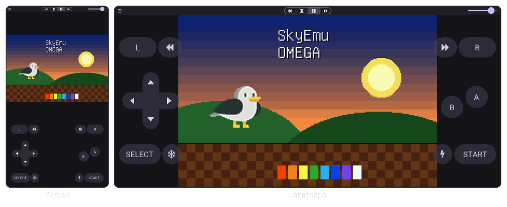
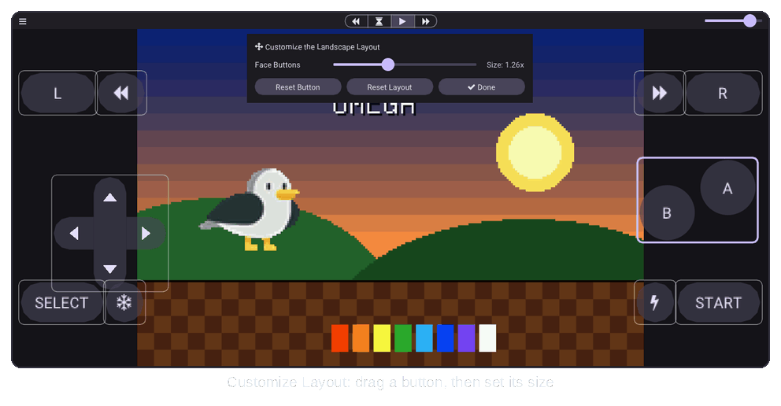

[SkyEmu OMEGA](../README.md) › [Docs](README.md) › Controllers

# Controllers

SkyEmu can be played with the keyboard, with a game controller or with the on-screen touch controller. This page
covers the on-screen controller and its layout editor, and how game controllers are mapped. The keyboard
bindings are in the [README](../README.md#-controls).

<picture>
  <source media="(prefers-color-scheme: dark)" srcset="images/controller-dark.png">
  <source media="(prefers-color-scheme: light)" srcset="images/controller-light.png">
  
</picture>

## On-screen controller

The on-screen controller appears as soon as the screen is touched. With **Hide when inactive** on (the default)
it fades out after a few seconds without a touch and comes back with the next one. With it off, the controller
is always shown, also on computers without a touch screen. While it is visible, clicking a button with the mouse
presses it.

| Button | Notes |
|---|---|
| D-pad | Slide your thumb between directions, diagonals work too |
| A, B | Plus X and Y for the Nintendo DS |
| L, R | Hidden for Game Boy games, which have no shoulder buttons |
| Start, Select | |
| Turbo (lightning bolt) | Keep Turbo pressed and tap a button: it fires repeatedly until you tap it again |
| Hold (snowflake) | Keep Hold pressed and tap a button: it stays pressed until you tap it again |
| Rewind, Fast Forward | Rewind or play at double speed while pressed, normal speed again when released |

All options are in **Menu → Touch Control Settings**, next to a portrait and a landscape preview:

| Option | What it does |
|---|---|
| **Show On-screen Controller** | Turns the controller off completely, for example when you always play with a game controller |
| **Customize Layout** | Opens the [layout editor](#custom-layouts) |
| **Reset Layouts** | Restores the default portrait and landscape layouts |
| **Scale**, **Opacity** | Size and transparency of all buttons |
| **Hide when inactive** | See above |
| **Enable Turbo and Hold Button Modifiers** | Shows the Turbo and Hold buttons |
| **Show Rewind and Fast Forward Buttons** | Adds them next to L and R |
| **Prevent Overlap in Portrait / Landscape** | Keeps the game screen clear of the controller, see [where the screen goes](#where-the-game-screen-goes) |
| **Button Labels** | Shows the names on the buttons |

With Material 3, Fluent and Adwaita the buttons are drawn in the style of the design: tonal buttons and a rounded
d-pad that fill with the accent color when pressed. SkyEmu Classic uses the button artwork of the skin.

## Custom layouts

<picture>
  <source media="(prefers-color-scheme: dark)" srcset="images/layout-editor-dark.png">
  <source media="(prefers-color-scheme: light)" srcset="images/layout-editor-light.png">
  
</picture>

Every part of the controller can be moved and resized:

1. Open **Menu → Touch Control Settings → Customize Layout**. The menu closes and the game pauses.
2. Drag a button to move it. It is selected and outlined in the accent color.
3. Change its size with the **Size** slider (0.5× to 2.5×), or with the mouse wheel over the screen.
4. **Reset Button** puts the selected button back, **Reset Layout** resets the whole layout.
5. Press **Done**. The game continues and the menu opens again.

These groups move together: the d-pad, the face buttons (A and B, plus X and Y on the DS), L, R, Start, Select,
Turbo, Hold, Rewind and Fast Forward.

The **portrait and landscape layouts are saved separately**, following the orientation of the window, so a phone
can have one layout for each way you hold it. Positions are stored relative to the screen area, so a layout
adapts to other screen sizes, and buttons are always kept on screen.

## Where the game screen goes

SkyEmu puts the controller below the screen or beside it, whichever leaves the larger game screen. With Material 3,
Fluent and Adwaita:

- **Below**: the game screen is centered in the space above the controller. If it does not fit there it keeps
  its size and overlaps the controller, unless **Prevent Overlap** is on for that orientation, which makes it
  smaller instead.
- **Beside**: the controller overlaps the edges of the game screen. With **Prevent Overlap** the screen shrinks to
  fit between the two halves of the controller.
- Without the controller the game screen is centered.

With SkyEmu Classic the skin decides where the game screen goes.

## Game controllers

Controllers are detected when they are connected and mapped automatically. Pick a controller in
**Menu → Controllers**. SkyEmu shows what kind of controller it is (Xbox, PlayStation, Nintendo Switch and others)
and names every binding after the button printed on it, such as *Cross*, *LB*, *ZL* or *Left Stick Up*.

### Face buttons

Xbox and PlayStation controllers have A at the bottom, while the GBA and DS have A on the right. **Face Buttons**
decides which one SkyEmu follows:

| Face Buttons | GBA / DS A | GBA / DS B | DS X | DS Y |
|---|---|---|---|---|
| **Match the Labels** (default) | A · Cross · A | B · Circle · B | X · Square · X | Y · Triangle · Y |
| **Match GBA Positions** | B · Circle · A | A · Cross · B | Y · Triangle · X | X · Square · Y |

Each cell lists the Xbox, PlayStation and Nintendo Switch button. Nintendo controllers already have A on the
right, so both options give the same result on them.

Changing the option rebinds the face buttons of the connected controller. It is also used for controllers that
have no saved bindings yet and by **Reset Default Controller Bindings**, so it can be chosen before a controller
is connected. Other bindings are not touched.

### Default bindings

| Console | Controller |
|---|---|
| D-pad | D-pad and left stick |
| L, R | Shoulder buttons (LB / RB, L1 / R1, L / R) and triggers |
| Start, Select | Start and Back (Menu / View, Options / Share or Create, Plus / Minus) |
| Pause | Guide (Xbox, PS or Home button) |
| Rewind, Fast Forward 2×, Fast Forward max | Back paddles 1, 2 and 3 on controllers that have them |

Click a binding and press a button to change it, the ✕ button clears it and **Reset Default Controller Bindings**
restores the defaults above. Bindings are saved for each controller model. The menu also shows whether the controller
supports rumble.

On Android controllers are read with the Android key codes, and **Face Buttons** works the same way.

## From another app

| Setting | [HTTP `/setting`](HTTP_CONTROL_SERVER.md#setting) | C API ([`skyemu_dll.h`](../src/skyemu_dll.h)) |
|---|---|---|
| On-screen controller | `touch_controller=1` or `0` | `se_set_touch_controller()` |
| Rewind and Fast Forward buttons | `touch_controls_show_speed=1` | `se_set_touch_controls_show_speed()` |
| Reset the layouts | `reset_touch_layout=1` | `se_reset_touch_layout()` |
| Open or close the layout editor | `touch_layout_editor=1` or `0` | |
| Face buttons | `controller_face_layout=0` or `1` | `se_set_controller_face_layout()` |
| Scale | `touch_controls_scale` | `se_set_touch_controls_scale()` |
| Opacity | `touch_controls_opacity` | `se_set_touch_controls_opacity()` |
| Hide when inactive | `auto_hide_touch_controls` | `se_set_auto_hide_touch_controls()` |

On Android, `MainSkyEmuObject` has the same calls with an `se_android_` prefix, for example
`se_android_set_touch_controller(int)`. Each setter has a matching getter.

> [!TIP]
> A host app that draws its own on-screen controls should turn SkyEmu's off with `se_set_touch_controller(0)`
> (or `touch_controller=0`) and send input with [`se_send_key()`](EMBEDDING.md#input) or the HTTP
> [`/input`](HTTP_CONTROL_SERVER.md#input) command.
