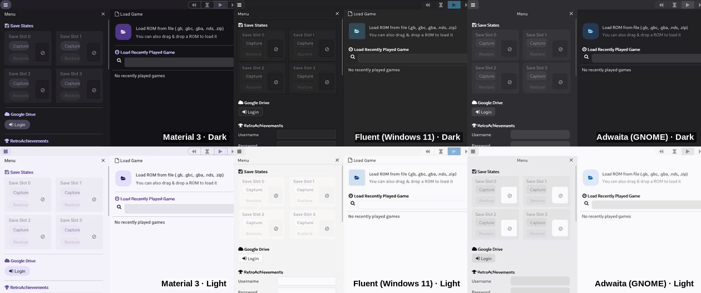
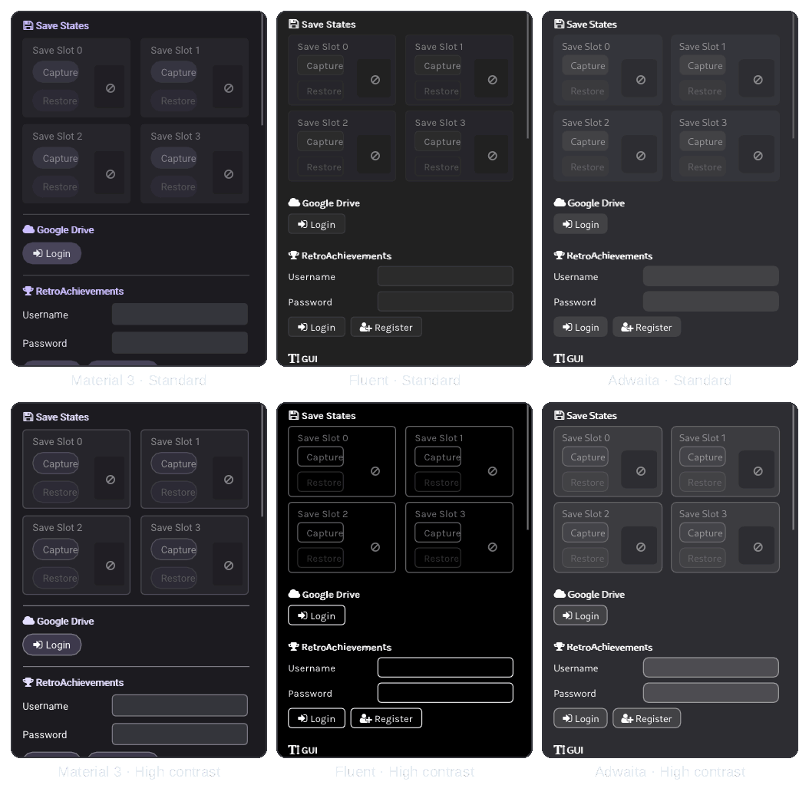

<sub>[SkyEmu OMEGA](../README.md) › [Docs](README.md) › Design systems</sub>

# Design systems

SkyEmu OMEGA's GUI follows the design language of the platform it runs on, including its light or dark mode,
contrast setting, accent color and UI font.

<picture>
  <source media="(prefers-color-scheme: dark)" srcset="images/hero-dark.png">
  <source media="(prefers-color-scheme: light)" srcset="images/hero-light.png">
  
</picture>

| Platform | Default design | Light / dark from | Accent from | UI font |
|---|---|---|---|---|
| Android | Material 3 / Material You | System dark theme | Wallpaper colors (Android 12+) | Roboto |
| Windows | Fluent (Windows 11 / WinUI 3) | Default app mode | Windows accent color | Segoe UI Variable, Segoe UI on Windows 10 |
| Linux, FreeBSD | Adwaita (GNOME / libadwaita) | Desktop portal or GNOME *Style* | GNOME 47+ accent color | GNOME interface font (Adwaita Sans, Cantarell) |
| Web | Material 3 | Browser `prefers-color-scheme` | Default accent | Bundled font |
| macOS, iOS | SkyEmu Classic | | | |

## Choosing a design

Every design is available on every platform. Pick one in **Menu → GUI → Design**:

| Design | Description |
|---|---|
| **Platform Native** | The design from the table above (default) |
| **SkyEmu Classic** | The original image skin with its Dark, Light and Black themes and [custom skins](CUSTOM_THEMES.md) |
| **Material 3** | Google's Material Design 3 with dynamic color |
| **Fluent (Windows 11)** | Microsoft's WinUI 3 look |
| **Adwaita (GNOME)** | The GNOME / libadwaita look |

With Material 3, Fluent or Adwaita selected, the same section offers:

- **Color Scheme**: *Follow System*, *Light*, *Dark* or *Black* (pure black surfaces for AMOLED screens).
- **Contrast**: *Follow System*, *Standard* or *High*. See [High contrast](#high-contrast).
- **Custom Accent Color**: replaces the system accent with a preset or any color from the picker. Material 3
  derives its whole tonal scheme from it, like Android does from a wallpaper.
- **Use System Font**: uses the platform UI font when it is installed and readable, otherwise the bundled font.
  The font file in use is shown below the option.

> [!NOTE]
> Settings from earlier versions are migrated: a custom skin keeps the classic design, and the Light and Black
> themes carry over as the color scheme.

## At a glance

| | Material 3 | Fluent | Adwaita |
|---|---|---|---|
| Top bar | Top app bar on a surface container | Title bar on Mica with a divider | Header bar with its bottom shade, centered titles |
| Playback toggles | Outlined segmented button | Linked toggles, accent when selected | Linked toggles, darker when selected |
| Buttons | Filled tonal pills | 4 px corners with a 1 px stroke | Flat, 6 px corners |
| Checkboxes | 2 dp corners, 2 dp outline | 4 px corners, accent fill | 4 px corners, accent fill |
| Sliders | Primary track and handle | Accent track, ring thumb with an accent dot | Accent track, light knob |
| Section titles | Primary color with dividers | Bold | Bold |
| Popups | 4 dp corners | 8 px corners with a stroke | 12 px corners with a border |

Also restyled in every design: text fields, combo boxes, the menu panel, save state cards, the game list and the
on-screen touch controls, which become tonal buttons with a rounded d-pad that fill with the accent when pressed.

The designs also place the game screen themselves instead of following the skin: centered, above the on-screen
controller in portrait and between its halves in landscape when overlap is prevented. The controller and its
layout editor are described in [Controllers](CONTROLLERS.md).

The window frame follows the GUI too: a dark title bar and matching caption colors on Windows 11 (DWM), and the
`_GTK_THEME_VARIANT` window property that GNOME Shell uses to draw light or dark decorations.

SkyEmu Classic renders exactly as before.

<details>
<summary><b>All three designs in light and dark</b></summary>



</details>

## High contrast

With **Contrast** set to *High*, or set to *Follow System* while the system asks for more contrast, every design
switches to its platform's high contrast style:

- **Material 3** is modeled on Material's high contrast scheme: darker accents in light mode and lighter ones in
  dark mode, accent containers as strong fills with white or black text, text and outlines tuned for 11:1 and
  7:1, and outlined buttons and fields.
- **Fluent** uses the colors of the active Windows contrast theme (*Aquatic*, *Desert*, *Dusk*, *Night sky* or a
  custom one), like WinUI apps do. The contrast theme also decides between light and dark. When Windows has no
  contrast theme active, SkyEmu uses colors modeled on *Desert* (light) and *Night sky* (dark).
- **Adwaita** keeps its colors and, like libadwaita's high contrast style, outlines buttons and fields and makes
  borders, dividers and dimmed labels much stronger. Text is fully opaque.

<picture>
  <source media="(prefers-color-scheme: dark)" srcset="images/contrast-dark.png">
  <source media="(prefers-color-scheme: light)" srcset="images/contrast-light.png">
  
</picture>

| Platform | *Follow System* turns high contrast on when |
|---|---|
| Windows | A contrast theme is on (Settings › Accessibility › Contrast themes) |
| Linux, FreeBSD | The desktop portal reports higher contrast, or GNOME's *High Contrast* accessibility setting is on |
| Android | The system contrast level is *High* (Android 14+), or *High contrast text* is on |
| Web | The browser reports `prefers-contrast: more` or forced colors |
| Host apps | The host reports it with `se_set_system_high_contrast()` (see [APIs](#apis)) |

SkyEmu Classic is not affected by the contrast setting.

## How the colors are made

[`src/se_design.c`](../src/se_design.c) builds the design tokens and has no Dear ImGui dependency.

- **Material 3** uses the *tonal spot* scheme of Android 12+. Tones are CIELAB L\* (the tone of Material's HCT
  color space) and hue and chroma are OKLCH, with chroma clipped to the sRGB gamut per tone. This reproduces the
  Material 3 baseline palette within 7/255 per channel (primary40 is exact) without porting the full HCT
  solver. On Android 12+ the 65 system palette colors (`system_accent1_0` … `system_neutral2_1000`) are used
  directly.
- **Fluent** uses the WinUI 3 theme resources: Mica base, layer and card fills, control fills and strokes, and
  `SystemAccentColorLight2` / `SystemAccentColorDark1` as the accent fill in dark / light mode.
- **Adwaita** uses the libadwaita 1.6 palette (window, header bar, sidebar, card and popover colors, widgets
  tinted with `alpha(currentColor, x)`) and computes `accent_color` from `accent_bg_color` the way libadwaita
  does.

A unit test checks the tones, the Material baseline, the Android palette path and that text stays readable (7:1
for body text, 4.5:1 for button labels, 3:1 on accent fills) for every design, color scheme, contrast level and a
set of accents. In high contrast it also requires 10:1 body text, 7:1 secondary text and button labels, and 3:1
borders:

```sh
cc -O2 -Isrc tools/se_design_test.c src/se_design.c -lm -o se_design_test && ./se_design_test
```

## APIs

### C / Windows DLL

From [`src/skyemu_dll.h`](../src/skyemu_dll.h), each with a matching getter:

```c
se_set_design_system(uint32_t design);                   // 0 native, 1 classic, 2 Material 3, 3 Fluent, 4 Adwaita
se_set_color_scheme(uint32_t scheme);                    // 0 system, 1 light, 2 dark, 3 black
se_set_contrast(uint32_t contrast);                      // 0 system, 1 standard, 2 high
se_set_accent_color(uint32_t rgb);                       // 0xRRGGBB, or 0xFFFFFFFF to follow the system
se_set_system_appearance(int dark, uint32_t accent_rgb); // what the host knows about the OS
se_set_system_high_contrast(int high_contrast);          // 1 on, 0 off, -1 let SkyEmu ask the OS
```

SkyEmu reads the Windows registry and the contrast theme itself. A host that cannot give it that access, such as
a packaged UWP or WinUI app, reports the appearance instead, and again whenever it changes:

```csharp
[DllImport("SkyEmu.dll")] static extern void se_set_system_appearance(int dark, uint accentRgb);
[DllImport("SkyEmu.dll")] static extern void se_set_system_high_contrast(int highContrast);

var ui = new Windows.UI.ViewManagement.UISettings();
var accessibility = new Windows.UI.ViewManagement.AccessibilitySettings();
void Report(){
    var bg = ui.GetColorValue(UIColorType.Background);
    var a = ui.GetColorValue(UIColorType.Accent);
    se_set_system_appearance(bg.R < 128 ? 1 : 0, (uint)(a.R << 16 | a.G << 8 | a.B));
    se_set_system_high_contrast(accessibility.HighContrast ? 1 : 0);
}
Report();
ui.ColorValuesChanged += (s, e) => Report();
accessibility.HighContrastChanged += (s, e) => Report();
```

### Android

`EnhancedNativeActivity.getSystemAppearance()` is called from native code for the dark mode flag, the
Material You palettes and the high contrast flag. The activity handles `uiMode` configuration changes, so switching the system theme
restyles the GUI without restarting the game. `MainSkyEmuObject` exposes the settings to host apps:

```java
se_android_set_design_system(int design);
se_android_set_color_scheme(int scheme);
se_android_set_contrast(int contrast);                  // 0 system, 1 standard, 2 high
se_android_set_accent_color(int rgb);                   // -1 follows the system
se_android_set_system_appearance(int dark, int accent); // for hosts with their own activity
se_android_set_system_high_contrast(int highContrast);  // for hosts with their own activity
```

### HTTP control server

[`/setting`](HTTP_CONTROL_SERVER.md#setting) accepts `design`, `color_scheme`, `contrast`, `accent` (hex
`RRGGBB` or `system`) and `system_font` (`0` / `1`):

```
http://localhost:8080/setting?design=2&color_scheme=1&contrast=2&accent=3584e4
```

[`/settings`](HTTP_CONTROL_SERVER.md#settings) reports `design_system`, `color_scheme`, `contrast`,
`use_custom_accent`, `custom_accent` and `use_bundled_font`.

## Notes

- Dear ImGui renders a single font weight, so bold titles are drawn with a second pass shifted by one point.
- On Linux the appearance and the contrast setting are read with `gdbus` (desktop portal) and `gsettings`. To avoid starting processes
  during gameplay it is only refreshed while no game is running.
- Fonts are checked before they reach Dear ImGui (TrueType or CFF outlines with a Unicode character map). CFF2
  variable fonts such as `Cantarell-VF.otf` are skipped in favor of the next candidate.
