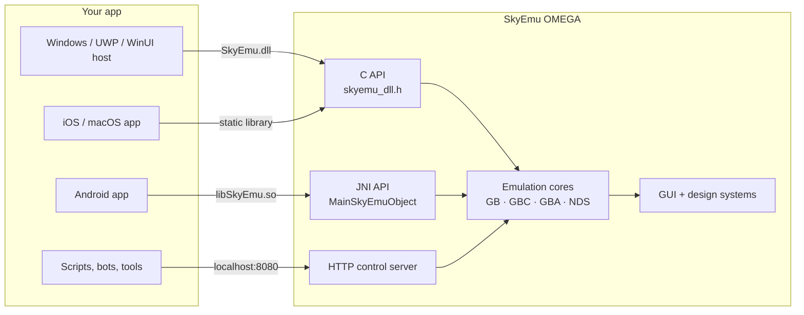

<sub>[SkyEmu OMEGA](../README.md) › [Docs](README.md) › Embedding</sub>

# Embedding SkyEmu in your app

SkyEmu OMEGA can run inside another application. The host starts the emulator, feeds it games and input, reads
its screen and changes any setting, while SkyEmu keeps its own renderer, audio and GUI.



| Integration | Platform | Entry point |
|---|---|---|
| [Windows DLL](#windows-dll) | Windows 10 / 11 | `SkyEmu.dll`, [`src/skyemu_dll.h`](../src/skyemu_dll.h) |
| [Android library](#android-library) | Android 7.0+ | `com.sky.SkyEmu.EnhancedNativeActivity`, `MainSkyEmuObject` |
| [Apple static libraries](#ios-and-macos) | iOS 15+, macOS | `libSkyEmu.a`, [`src/skyemu_dll.h`](../src/skyemu_dll.h) |
| [HTTP control server](HTTP_CONTROL_SERVER.md) | All native builds | `http://localhost:8080` |

## C API

[`src/skyemu_dll.h`](../src/skyemu_dll.h) is the public header. On Windows the functions are exported from the
DLL; on the other platforms they are plain C functions of the library.

### Content and UI

| Function | Description |
|---|---|
| `se_load_rom(path)` | Loads and starts a `.gb`, `.gbc`, `.gba`, `.nds` or `.zip` file. An `.ips`, `.ups` or `.bps` patch is added to the running game instead, like `se_load_patch()`. |
| `se_load_html(path)` | Loads an HTML page that the HTTP control server serves at `/index.html` |
| `se_show_ui()` / `se_hide_ui()` | Shows or hides the whole SkyEmu GUI (menu bar, panels, touch controls) |
| `se_stretch_to_fit(on)` | Stretches the game screen to the window |
| `se_capture_state_slot(slot)` / `se_restore_state_slot(slot)` | Saves or loads save state slot 0–3 |

### Input

`se_send_key(name, value)` presses (`1.0`) or releases (`0.0`) an input, exactly like the HTTP `/input` command.
The names are the keybind names shown in the GUI:

`A` `B` `X` `Y` `Up` `Down` `Left` `Right` `L` `R` `Start` `Select` `Fold Screen (NDS)` `Tap Screen (NDS)`
`Capture State 0`–`3` `Restore State 0`–`3` `Reset Game` `Turbo A` `Turbo B` `Turbo X` `Turbo Y` `Turbo L`
`Turbo R` `Solar Sensor+` `Solar Sensor-` `Toggle Full Screen` `Screenshot` `Record Video` `Save Replay`

### Framebuffer

| Function | Description |
|---|---|
| `se_get_system()` | `SE_SYSTEM_NONE`, `SE_SYSTEM_GB`, `SE_SYSTEM_GBA` or `SE_SYSTEM_NDS` |
| `se_get_framebuffer_dimensions(&w, &h)` | Size of one screen |
| `se_get_framebuffer_count()` | 1, or 2 for the DS |
| `se_get_framebuffer(index)` | Pointer to a screen, valid until the next frame |
| `se_copy_framebuffer(buffer, size)` | Copies all screens into your buffer |
| `se_is_frame_ready()` | A new frame has been produced |
| `se_get_screenshot(&w, &h)` | All screens as one contiguous image |

Pixels are RGBA, 4 bytes per pixel.

### Settings

Every persistent setting has a getter and a setter, for example `se_set_volume` / `se_get_volume`,
`se_set_screen_shader`, `se_set_gb_palette`, `se_set_nds_layout`, `se_set_hardcore_mode` and
`se_set_gui_scale_factor`. Changes are saved like changes made in the GUI.

A host with a second display or a folding screen can arrange the DS screens:

```c
se_set_nds_layout(9);                     // 9 top screen only, 10 bottom screen only, 1 vertical, ...
se_set_nds_swap_screens(1);               // the touch screen where the top screen would be
se_set_nds_screen_gap(90);                // DS pixels between the screens, 0-96
se_set_nds_small_screen(75);              // small screen of the large and hybrid layouts, 25-100 percent
```

All layouts are listed in [Display and shaders › DS screen layouts](GRAPHICS.md#ds-screen-layouts).

The look of the GUI is controlled with:

```c
se_set_design_system(2);                  // 0 native, 1 classic, 2 Material 3, 3 Fluent, 4 Adwaita
se_set_color_scheme(0);                   // 0 system, 1 light, 2 dark, 3 black
se_set_contrast(0);                       // 0 system, 1 standard, 2 high
se_set_accent_color(0x3584E4);            // or 0xFFFFFFFF to follow the system
se_set_system_appearance(1, 0x0078D4);    // what the host knows about the OS: dark, accent
se_set_system_high_contrast(1);           // and whether it uses high contrast (-1 if unknown)
```

See [Design systems](DESIGN_SYSTEMS.md) for what each value does. The screen shaders and the other display
options are described in [Display and shaders](GRAPHICS.md).

The on-screen controller appears when the screen is touched. A host that draws its own controls turns it off and
sends input with `se_send_key()` instead:

```c
se_set_touch_controller(0);               // 1 to show it again
se_set_controller_face_layout(1);         // game controllers: A on the right like the GBA (0 = by label)
```

The layout editor, the controller options and their API are described in [Controllers](CONTROLLERS.md).

### Patches, cheats and achievements

```c
se_load_patch("/path/to/translation.ips");   // adds a patch to the running game, false if it was refused
se_get_patch_status();                        // "translation.ips (IPS)", or why it could not be applied

int id = se_add_cheat("Infinite Lives", "69E24E1F 0BA154FB", 1);
se_set_cheat_enabled(id, 0);
const char* cheats = se_get_cheats_json();   // [{"id", "name", "enabled", "code"}, ...]

se_cheat_search_start(1, 0);                 // cheat finder: 8-bit unsigned values
/* ... the value changes in the game ... */
if (se_cheat_search_filter(9, 1) == 1) {     // 9 = decreased by 1
  uint32_t address, value;
  se_cheat_search_get_result(0, &address, &value);
  se_make_cheat(address, 99, 1, "Infinite Lives");
}

se_ra_login("username", "password");        // RetroAchievements, the login token is saved
se_set_ra_spectator(1);
const char* achievements = se_get_achievements_json();
```

### Recording and streaming

```c
se_set_record_scale(3);                      // videos at 3x the console screen
se_start_video_recording();                  // AVI with sound, every emulated frame
/* ... */
se_stop_video_recording();
printf("%s\n", se_get_last_recording_path());

se_set_replay_seconds(30);                   // keep the last 30 seconds
se_save_replay();                            // and save them as a video
se_save_screenshot();
```

The live streams, the Remote Play page and the overlay are served by the
[HTTP control server](HTTP_CONTROL_SERVER.md#streammjpg--streamwav). See
[Recording and streaming](RECORDING_AND_STREAMING.md).

Strings returned by the `_json` and status functions stay valid until the same function is called again. The
search comparisons, the JSON fields and the other functions are listed in [`skyemu_dll.h`](../src/skyemu_dll.h)
and explained in [Cheats and ROM patches](CHEATS_AND_PATCHES.md) and [RetroAchievements](RETROACHIEVEMENTS.md).

## Windows DLL

The emulator is built as `SkyEmu.dll`. The `SkyEmu.exe` next to it is a few lines that call `win_main` (see
[`src/win_launcher.c`](../src/win_launcher.c)), so players start SkyEmu like any app. A host app does the same:
load the DLL, register the callbacks you need and call `win_main`, which creates the SkyEmu window and runs until
it is closed.

```c
#include "skyemu_dll.h"

static void __stdcall on_input(const char* key, const char* value){ /* mirror remote input */ }
static void __stdcall on_ping(void){ /* the HTTP /ping command was received */ }
static void __stdcall on_menu(void){ /* the HTTP /external_menu command asks for the host menu */ }

int main(int argc, char* argv[]){
  set_remote_keycode_callback(on_input);
  set_ping_callback(on_ping);
  set_external_menu_callback(on_menu);
  return win_main(argc, argv);   // accepts the same arguments as the SkyEmu executable
}
```

| Callback | Called when |
|---|---|
| `RemoteKeycodeCallback(key, value)` | The HTTP `/input` command sets an input |
| `PingCallback()` | The HTTP `/ping` command is received |
| `ExternalMenuCallback()` | The HTTP `/external_menu` command is received |

From C#, declare the functions with `[DllImport("SkyEmu.dll")]`. A packaged UWP or WinUI host that SkyEmu cannot
read the registry for should report the system theme itself, see
[Design systems › C / Windows DLL](DESIGN_SYSTEMS.md#c--windows-dll).

## Android library

`tools/android_project` builds an Android library (`app-release.aar`) that contains `libSkyEmu.so` and the Java
classes, and the SkyEmu app (`SkyEmu-v32-release.apk`) built from it. See the
[Android project page](../tools/android_project/README.md) for the build.

A host app depends on the library, either on the module inside the same Gradle build or on the AAR file:

```groovy
dependencies {
    implementation project(':app')                   // the module, as the SkyEmu app does
    // or: implementation files('libs/app-release.aar')
}
```

The library's manifest declares `EnhancedNativeActivity` but no launcher entry; the app module adds the
`MAIN` / `LAUNCHER` intent filter in its own manifest, see
[`standalone/src/main/AndroidManifest.xml`](../tools/android_project/standalone/src/main/AndroidManifest.xml).

### The activity

`com.sky.SkyEmu.EnhancedNativeActivity` is a `NativeActivity` that runs SkyEmu full screen. It handles game
controllers, the on-screen keyboard, opening files from other apps and the system theme. It has convenience
methods for the host:

| Method | Description |
|---|---|
| `LoadRom(path)` / `LoadFile(path)` | Loads a game, or a save/BIOS file |
| `LoadHtml(path)` | Loads the page served by the HTTP control server |
| `ShowUI()` / `HideUI()` | Shows or hides the SkyEmu GUI |
| `StretchOn()` / `StretchOff()` | Stretches the game screen |

### The settings API

`com.sky.SkyEmu.MainSkyEmuObject` exposes the C API to Java as `se_android_*` methods, for example
`se_android_send_key(String, float)`, `se_android_set_screen_shader(int)`, `se_android_set_volume(float)`,
`se_android_capture_state_slot(int)` and `se_android_set_design_system(int)`. Patches, cheats, the cheat finder
and RetroAchievements are there too, for example `se_android_load_patch(String)`, `se_android_add_cheat(String,
String, int)`, `se_android_cheat_search_filter(int, long)` and `se_android_get_achievements_json()`. Addresses and
values are passed as `long` so the whole unsigned 32-bit range fits. Recording is available as
`se_android_start_video_recording()`, `se_android_save_screenshot()`, `se_android_save_replay()` and the setters
of its options.

### Your own activity

When a host replaces `EnhancedNativeActivity`, native code still calls these methods on the activity, so they
must exist with the same signatures:

| Method | Purpose |
|---|---|
| `float getDPIScale()` | GUI scale |
| `float getVisibleTop()`, `float getVisibleBottom()` | Area not covered by the keyboard |
| `static String getLanguage()` | GUI language |
| `int getEvent()`, `void pollKeyboard()` | Keyboard and controller events |
| `void showKeyboard()`, `void hideKeyboard()` | On-screen keyboard |
| `void openFile()` | File picker |
| `void requestPermissions()` | Storage permissions |
| `int[] getSystemAppearance()` | Dark mode, Material You colors and high contrast (optional, layout below) |
| `void setRemoteKeycodeCallback(String)` | HTTP `/input` notifications (first character of the input name and of the value, e.g. `"A=1"`) |
| `void ping()` | HTTP `/ping` notifications |
| `void openExternalMenu()` | HTTP `/external_menu` requests |

If `getSystemAppearance` is missing, call `se_android_set_system_appearance(dark, accent)` and
`se_android_set_system_high_contrast(high)` whenever the theme changes.

`getSystemAppearance()` returns up to 69 values: `[0]` dark (1, 0 or -1 if unknown), `[1]` accent as ARGB (0 if
unknown), `[2]` the number of Material You palettes (0 or 5), `[3]`–`[67]` the `system_accent1`,
`system_accent2`, `system_accent3`, `system_neutral1` and `system_neutral2` colors at tones 100, 99, 95, 90, 80, 70,
60, 50, 40, 30, 20, 10 and 0 (zeros when `[2]` is 0) and `[68]` high contrast (1, 0 or -1). Shorter arrays from
older hosts still work.

## iOS and macOS

With `BUILD_IOS_STATIC_LIB` (the iOS default) or `BUILD_MACOS_STATIC_LIB`, SkyEmu builds as a static library
that an Xcode app links. The `host_app_ios` and `host_app_macos` folders contain the generated Xcode projects,
and [`App/ios_support.h`](../App/ios_support.h) declares the platform hooks the library calls (file picker, safe
area insets, and the remote input, ping and external menu notifications), implemented in `App/ios_support.m`. Build steps are in
[Building › iOS](BUILDING.md#ios).

On iOS the library does not define `main()`. sokol's entry point is renamed `main_ios()`, which starts the UIKit
app and does not return, so the host app's `main` hands over to it:

```objc
int main_ios(int argc, char* argv[]);

int main(int argc, char* argv[]) {
    return main_ios(argc, argv);
}
```

## HTTP control server

Every native build can be scripted over HTTP, from any language. It is the easiest way to drive SkyEmu from
tools, tests and bots. See the [HTTP control server reference](HTTP_CONTROL_SERVER.md).
