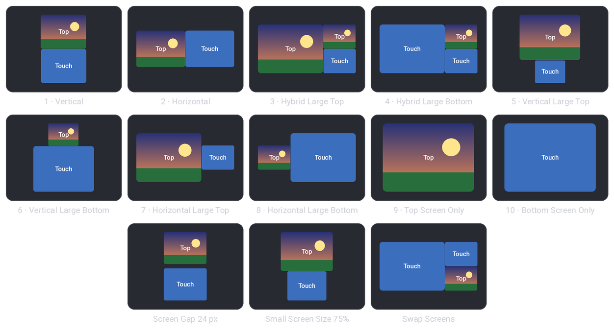

<sub>[SkyEmu OMEGA](../README.md) › [Docs](README.md) › Display and shaders</sub>

# Display and shaders

How SkyEmu draws the emulated screen: the screen shaders, color correction, and the options for size, rotation
and the DS screen layout. Everything on this page is in **Menu → Display Settings** and is saved with the other
settings.

<picture>
  <source media="(prefers-color-scheme: dark)" srcset="images/shaders-dark.png">
  <source media="(prefers-color-scheme: light)" srcset="images/shaders-light.png">
  
</picture>

<p align="center"><sub>A Game Boy Advance scene shown at about 5× scale with each shader. The close-ups are enlarged 2× more so the effects are easy to see.</sub></p>

## Screen shaders

| # | Shader | What it does |
|---|---|---|
| 0 | **Pixelate** | Sharp square pixels. Pixel edges are anti-aliased, so the picture stays even at sizes that are not a whole multiple of the console's resolution |
| 1 | **Bilinear** | Smooth interpolation between pixels |
| 2 | **LCD** | A visible pixel grid like a handheld LCD. Original Game Boy games get a lighter, softer grid, like the gaps between the pixels of its screen |
| 3 | **LCD & Subpixels** | The pixel grid plus red, green and blue subpixel stripes. This is the default. Original Game Boy games use *LCD* instead |
| 4 | **Smooth Upscale (xBRZ)** | Rounds the edges of pixel art with Hyllian's xBR / xBRZ edge detection |
| 5 | **CRT** | A television look: Gaussian scanlines that get wider on bright lines, a red, green and blue aperture grille and a soft horizontal beam |
| 6 | **Scanlines** | Sharp pixels with darkened gaps between the lines |

> [!TIP]
> *CRT* and *Scanlines* need a few screen pixels per emulated line. They fade in between 2 and 3.5 screen pixels
> per line (a Game Boy Advance screen 320 to 560 pixels tall) and switch off below that, where scanlines would
> turn into moiré patterns.

The aperture grille of *CRT* is drawn in physical screen pixels, one stripe per pixel, so it stays aligned with
your display at any window size.

## Color

| Option | What it does |
|---|---|
| **Color Correction** | Strength (0 to 1) of the console screen simulation. GBA, DS and Game Boy Color screens were dimmer and less saturated than a modern display, and many games were colored for that. At 0 the raw colors are shown |
| **GBA Color Correction Type** | *SkyEmu* or *Higan*, two models of the Game Boy Advance LCD |
| **Screen Ghosting** | Blends in the previous frames like a slow handheld LCD. Some games rely on it for transparency and flicker effects |
| **Game Boy Color Palette** | The four shades used for original Game Boy games. The reset button restores the default palette |

## Size and layout

| Option | What it does |
|---|---|
| **Screen Rotation** | 0°, 90°, 180° or 270°, for example for games played with the console turned sideways |
| **Force Integer Scaling** | Only scales by whole numbers so every console pixel covers the same number of screen pixels |
| **Stretch Screen to Fit** | Fills the window, ignoring the aspect ratio |
| **Show Screen Bezel** | Draws the bezel of the skin around the screen (only when the skin has one) |
| **NDS Screen Layout** | Where the two DS screens go, see [DS screen layouts](#ds-screen-layouts) |

## DS screen layouts

<picture>
  <source media="(prefers-color-scheme: dark)" srcset="images/ds-layouts-dark.png">
  <source media="(prefers-color-scheme: light)" srcset="images/ds-layouts-light.png">
  
</picture>

**NDS Screen Layout** places the top screen and the touch screen. *Auto* (`0`) uses *Vertical* in portrait windows
and *Hybrid Large Top* in landscape windows, and *Vertical* while the on-screen controller is shown.

| # | Layout | Screens |
|---|---|---|
| 1 | **Vertical** | Top screen above the touch screen, like the console |
| 2 | **Horizontal** | Side by side, the top screen on the left |
| 3 | **Hybrid Large Top** | A large top screen, and both screens small beside it |
| 4 | **Hybrid Large Bottom** | A large touch screen, and both screens small beside it |
| 5, 6 | **Vertical Large Top** / **Bottom** | One screen large, the other small below or above it |
| 7, 8 | **Horizontal Large Top** / **Bottom** | One screen large, the other small beside it |
| 9 | **Top Screen Only** | Only the top screen, for games that barely use the touch screen |
| 10 | **Bottom Screen Only** | Only the touch screen |

| Option | What it does |
|---|---|
| **Swap Screens** | Exchanges the two screens, so the touch screen goes where the top screen would. Hotkey <kbd>F8</kbd> (**Swap Screens (NDS)** in **Menu → Keybinds**). With *Top Screen Only* or *Bottom Screen Only* the hotkey switches between the two screens during play |
| **Screen Gap** | Space between the screens, 0 to 96 DS pixels (the DS has about 90 between its screens) |
| **Small Screen Size** | Size of the small screen of the *Large* and *Hybrid* layouts, 25% to 100% of the large one (50% by default) |

The touch screen takes taps and clicks wherever it is shown, also when it is shown twice by the *Hybrid* layouts.
Screen rotation turns the whole layout, so *Horizontal* rotated 90° shows the screens one above the other.

> [!NOTE]
> Before this version *Horizontal* showed the touch screen on the left. It now matches *Horizontal Large Top* and
> other DS emulators; turn on **Swap Screens** for the old order.

## Changing them from another app

| Setting | [HTTP `/setting`](HTTP_CONTROL_SERVER.md#setting) | C API ([`skyemu_dll.h`](../src/skyemu_dll.h)) |
|---|---|---|
| Screen shader | `shader=0` … `6` | `se_set_screen_shader()` |
| Screen rotation | `screen_rotation=0` … `3` | `se_set_screen_rotation()` |
| Color correction | `color_correction=0.0` … `1.0` | `se_set_color_correction()` |
| GBA color correction type | `gba_color_correction_mode=0` or `1` | `se_set_gba_color_correction_mode()` |
| Screen ghosting | `ghosting=0.0` … `1.0` | `se_set_ghosting()` |
| Integer scaling | `integer_scaling=0` or `1` | `se_set_integer_scaling()` |
| Stretch to fit | [`/stretch_on`, `/stretch_off`](HTTP_CONTROL_SERVER.md#stretch_on--stretch_off) | `se_stretch_to_fit()` |
| NDS layout | `nds_layout=0` … `10` | `se_set_nds_layout()` |
| Swap DS screens | `nds_swap_screens=0` or `1` | `se_set_nds_swap_screens()` |
| DS screen gap | `nds_screen_gap=0` … `96` | `se_set_nds_screen_gap()` |
| DS small screen size | `nds_small_screen=25` … `100` (percent) | `se_set_nds_small_screen()` |

On Android, `MainSkyEmuObject` has the same calls with an `se_android_` prefix, for example
`se_android_set_screen_shader(int)` (stretch to fit is `se_android_set_stretch_to_fit(int)`). Each setter has a
matching getter.

```
http://localhost:8080/setting?shader=5&integer_scaling=1
```

## Writing a shader

All screen shaders are one program in [`src/lcd_shaders.shd`](../src/lcd_shaders.shd). The fragment shader
switches on `display_mode`, which is the number in the table above, and gets the console framebuffer as `tex`
plus these uniforms:

| Uniform | Meaning |
|---|---|
| `emu_lcd_size` | Console screen size in pixels (240×160 for GBA, 256×192 per DS screen, 160×144 for GB) |
| `render_size` | Size of the screen on the display, in display pixels |
| `color_correction_strength`, `red_color`, `green_color`, `blue_color`, `input_gamma` | The color correction of the current console, applied by `sample_color_correct()` |
| `lcd_is_grayscale` | Set for original Game Boy games |
| `integer_scaling` | Set when *Force Integer Scaling* is on |

To add a shader:

1. Add a branch for the next `display_mode` at the end of `main()` in `src/lcd_shaders.shd`. Sample the screen
   with `sample_color_correct()` so color correction keeps working.
2. Regenerate [`src/lcd_shaders.h`](../src/lcd_shaders.h) for every graphics backend with the bundled
   `sokol-shdc` (`tools/sokol-tools/bin/linux`, `osx` or `osx_arm64`):

   ```sh
   cd src
   ../tools/sokol-tools/bin/linux/sokol-shdc -i lcd_shaders.shd -o lcd_shaders.h \
       -l glsl330:glsl100:glsl300es:hlsl4:metal_macos:metal_ios:metal_sim:wgpu -b
   ```

3. Add the name to the *Screen Shader* list in `src/main.c` and raise `SE_SCREEN_SHADER_COUNT`.
