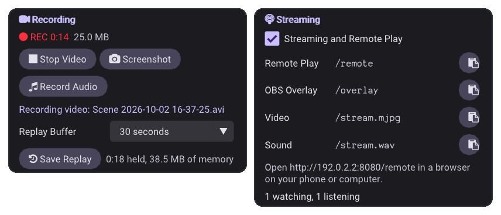
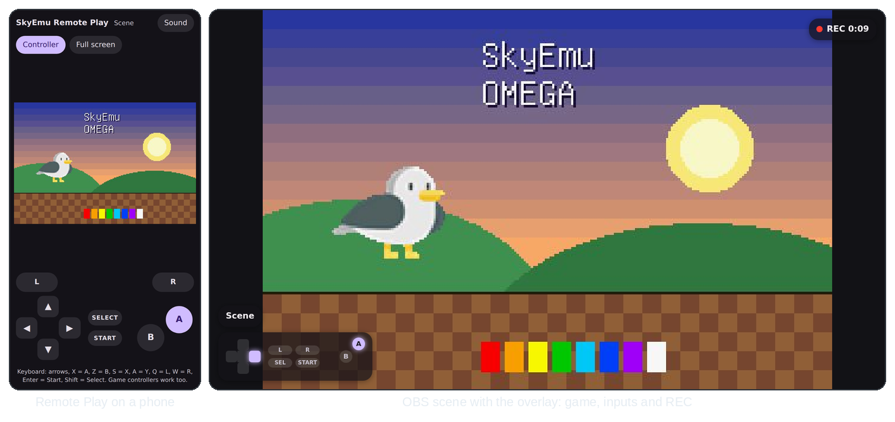

<sub>[SkyEmu OMEGA](../README.md) › [Docs](README.md) › Recording and streaming</sub>

# Recording and streaming

SkyEmu records gameplay videos, sound and screenshots without any other software, keeps a replay of the last
moments so you can save something after it happened, and streams the game to a browser, a phone or streaming
software such as OBS.

<picture>
  <source media="(prefers-color-scheme: dark)" srcset="images/recording-dark.png">
  <source media="(prefers-color-scheme: light)" srcset="images/recording-light.png">
  
</picture>

## Recording

| Action | Hotkey | Menu → Recording |
|---|---|---|
| Take a screenshot | <kbd>F12</kbd> | **Screenshot** |
| Start or stop a video | <kbd>F9</kbd> | **Record Video** / **Stop Video** |
| Save the replay buffer | <kbd>F10</kbd> | **Save Replay** |
| Start or stop recording sound only | | **Record Audio** / **Stop Audio** |

The hotkeys can be changed in **Menu → Keybinds** and bound to a game controller button. While a video or sound
is recorded, a red **REC** badge with the length so far is shown in the menu bar; click it to stop. A short
message confirms every saved file.

### What is recorded

- **Every emulated frame and its sound.** A video plays at normal speed even when parts were fast forwarded, and
  the sound stays in step with the picture to the sample, also while a game has its sound turned off.
- **The console's own screen**, at 1× to 4× its size with sharp pixels. Shaders, color correction and the GUI are
  not part of the video. The DS records both screens, one above the other.
- **Only what is played.** Paused time is not recorded, rewinding is recorded as you see it.

Loading another game or quitting SkyEmu finishes the recording, so the file is always complete.

### Files

Files are named after the game and the time, for example `Pokemon Emerald 2026-10-02 14-05-33.avi`. They are
saved in the **Recording Path** (**Menu → Additional Search Paths**) or, when it is empty, next to the save file.
On Android the default folder is `Movies/SkyEmu`, and the web version downloads every file.

| Kind | Format |
|---|---|
| Video | AVI with MJPEG video and 48 kHz 16 bit stereo PCM sound. Plays in VLC, mpv and the Windows Media Player, and opens in video editors built on FFmpeg such as Kdenlive and Shotcut. |
| Sound | WAV, 48 kHz 16 bit stereo |
| Screenshot | PNG at 1× to 8× (**Screenshot Size**) |

| Video Quality | Video at 2×, roughly |
|---|---|
| **High** (default) | 100 MB per minute |
| **Standard (smaller files)** | 55 MB per minute |
| **Lossless (very large files)** | 1.6 GB per minute, uncompressed frames for editing without any loss |

Long recordings continue in a new file every 1 GB (`… (2).avi`, `… (3).avi`) so they open everywhere.

> [!TIP]
> Websites and phones want MP4. Convert a recording with [ffmpeg](https://ffmpeg.org):
>
> ```sh
> ffmpeg -i "Game 2026-10-02 14-05-33.avi" -c:v libx264 -crf 18 -pix_fmt yuv420p -c:a aac "Game.mp4"
> ```
>
> Record at 3× or 4× before uploading pixel art: video sites scale small videos up with blur.

### Replay buffer

Pick a length in **Replay Buffer** (15 seconds to 2 minutes). SkyEmu then keeps the last moments of play in memory,
and **Save Replay** (<kbd>F10</kbd>) writes them as a video, like the instant replay of a game console. The menu
shows how much is held and how much memory it uses: with **High** quality about 70 MB per minute at 1× and 130 MB
per minute at 2×. With **Lossless** the replay buffer keeps **High** quality frames.

## Streaming and Remote Play

<picture>
  <source media="(prefers-color-scheme: dark)" srcset="images/streaming-dark.png">
  <source media="(prefers-color-scheme: light)" srcset="images/streaming-light.png">
  
</picture>

Turn on **Menu → Streaming → Streaming and Remote Play** (this is the [HTTP control server](HTTP_CONTROL_SERVER.md),
port 8080 by default). The menu lists the addresses, with a button to copy each one, and how many devices are
watching and listening.

| Address | What it is |
|---|---|
| `http://<computer>:8080/remote` | **Remote Play**: watch, listen and play in any browser |
| `http://<computer>:8080/overlay` | **Overlay** for streaming software: buttons held, game, rich presence, REC |
| `http://<computer>:8080/stream.mjpg` | Live video (MJPEG) |
| `http://<computer>:8080/stream.wav` | Live sound (endless WAV) |

`<computer>` is `localhost` on the same computer. Other devices use its address on the network, which the menu
shows. **Stream Size** (1× to 3×) and **Frame Rate** (60 or 30 fps for slower networks) set the video stream.

> [!WARNING]
> Every device on your network can open these pages and also control SkyEmu through the HTTP control server.
> Turn streaming off on networks you don't trust.

### Remote Play

Open the Remote Play address on a phone, a tablet or another computer:

- **Controller** shows a touch controller (on by default on touch screens). Slide your thumb across the d-pad for
  diagonals.
- Keyboards work with the arrow keys, <kbd>X</kbd> = A, <kbd>Z</kbd> = B, <kbd>S</kbd> = X, <kbd>A</kbd> = Y,
  <kbd>Q</kbd> = L, <kbd>W</kbd> = R, <kbd>Enter</kbd> = Start and <kbd>Shift</kbd> = Select. Game controllers
  connected to that device work too, with A on the right like the GBA.
- **Sound** plays the game's sound on that device (browsers only start sound after a tap).
- Leaving the page or switching apps releases every button.

The picture arrives with a short delay that depends on the network, so Remote Play suits slower games best.
While you play in RetroAchievements Hardcore Mode, Remote Play still shows the game, but its controls are off.

### OBS and other streaming software

| OBS source | Settings |
|---|---|
| **Browser** | URL `http://localhost:8080/overlay`, width 1280, height 720. The page is transparent. |
| **Media Source** (optional) | Untick *Local File*, input `http://localhost:8080/stream.mjpg`. Add a second one with `/stream.wav` for the sound. |

Instead of the Media Sources you can capture the SkyEmu window and the desktop sound as usual; the video stream
has only the game, without the GUI.

The overlay takes options in its address, for example `/overlay?scale=1.5&accent=ff8800`:

| Option | Effect |
|---|---|
| `inputs=0` | Hides the input display |
| `game=0` | Hides the game name and the RetroAchievements rich presence |
| `rec=0` | Hides the REC badge |
| `accent=RRGGBB` | Color of pressed buttons |
| `scale=1.5` | Size of everything |

The streams, the overlay and the recording commands also work in Hardcore Mode, as they only show the game.

## From another app

| What | [HTTP control server](HTTP_CONTROL_SERVER.md) | C API ([`skyemu_dll.h`](../src/skyemu_dll.h)) |
|---|---|---|
| Start or stop a video or sound recording | [`/record`](HTTP_CONTROL_SERVER.md#record--recording)`?video=1&audio=0` | `se_start_video_recording()`, `se_stop_video_recording()`, `se_start_audio_recording()`, `se_stop_audio_recording()` |
| State, last file, last message | [`/recording`](HTTP_CONTROL_SERVER.md#record--recording) | `se_get_recording_json()`, `se_get_last_recording_path()` |
| Screenshot | [`/save_screenshot`](HTTP_CONTROL_SERVER.md#save_screenshot--save_replay) | `se_save_screenshot()` |
| Save the replay | [`/save_replay`](HTTP_CONTROL_SERVER.md#save_screenshot--save_replay) | `se_save_replay()` |
| Options | `record_scale`, `record_format`, `record_audio`, `replay_seconds`, `screenshot_scale`, `stream_scale`, `stream_fps` with [`/setting`](HTTP_CONTROL_SERVER.md#setting) | `se_set_record_scale()` and the others |
| Buttons held | [`/input_state`](HTTP_CONTROL_SERVER.md#input_state) | |

On Android, `MainSkyEmuObject` has the same calls with an `se_android_` prefix, for example
`se_android_start_video_recording()`. A chat bot can save clips with `/save_replay`, and a host app can bind the
hotkeys **Screenshot**, **Record Video** and **Save Replay** with [`se_send_key()`](EMBEDDING.md#input).

## For developers

The AVI, WAV and replay code ([`src/se_record.c`](../src/se_record.c)) has unit tests that read every file back and
compare each frame and sample, run by the *Unit tests* workflow:

```sh
cc -O2 -Isrc tools/se_record_test.c src/se_record.c src/stb.c -lm -o se_record_test && ./se_record_test
```

The cores pass every sound sample to a tap (`audio_tap` in `sb_emu_state_t`) while something records or listens,
also the samples the speakers drop during fast forward. The Remote Play and overlay pages are in
[`src/web/`](../src/web); after changing them run `python3 tools/embed_web_pages.py` to update
`src/se_web_pages.h`.
